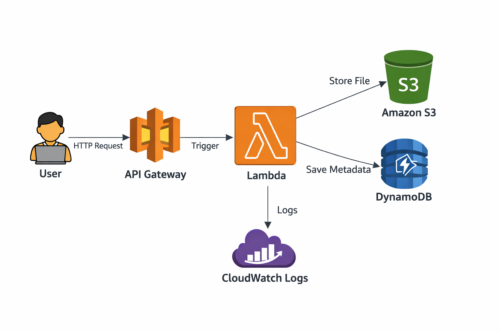
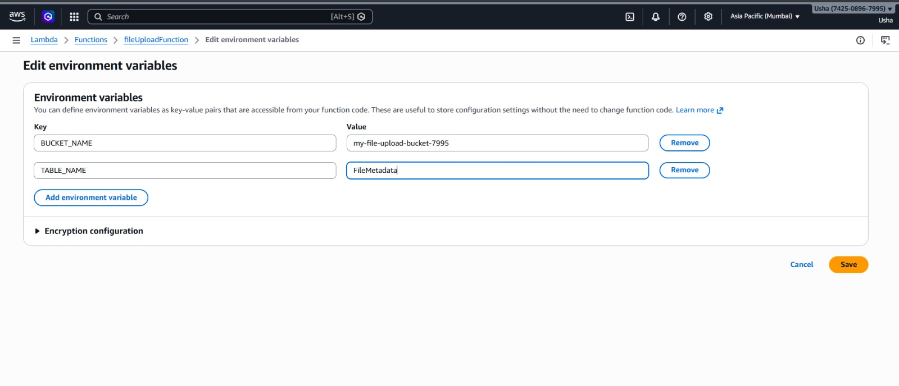
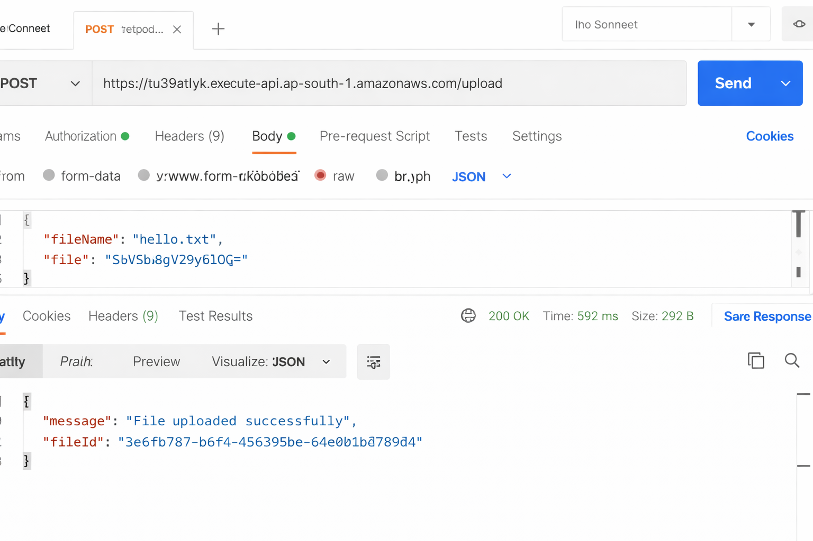
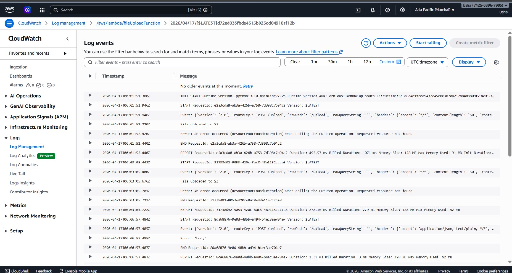

# AWS Serverless File Upload System

## Overview
This project is a serverless backend system built using AWS services. It allows users to upload files using an API. The files are processed using AWS Lambda, stored in Amazon S3, and their metadata is saved in DynamoDB.

## Services Used
- API Gateway
- AWS Lambda
- Amazon S3
- DynamoDB
- CloudWatch

## Architecture Diagram


## Working Flow
1. User sends a POST request using API Gateway
2. API Gateway triggers AWS Lambda
3. Lambda uploads file to S3
4. Lambda stores metadata in DynamoDB
5. Logs are stored in CloudWatch

## Environment Variables
## Environment Variables
- BUCKET_NAME: my-file-upload-bucket-7995  
- TABLE_NAME: FileMetadata

## API Testing (Postman)

**POST Request URL:**
https://tu39at1jyk.execute-api.ap-south-1.amazonaws.com/upload

## Screenshots

### Environment Variables


### API Test Success


### CloudWatch Logs



Body:
```json
{
  "file": "Hello World",
  "file_name": "test.txt"
}
```
## Security
IAM role is configured with least privilege access:
- S3: PutObject
- DynamoDB: PutItem
- CloudWatch: Logs Write Access

## Conclusion
This project demonstrates a scalable and cost-efficient serverless architecture using AWS.


